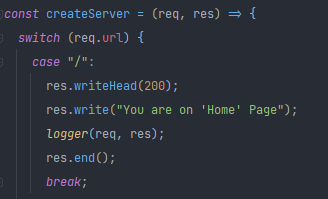
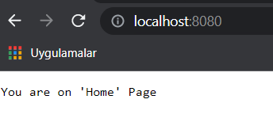
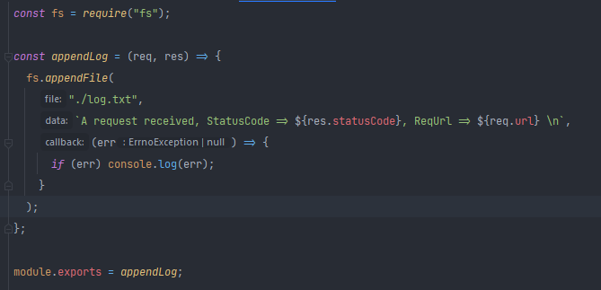
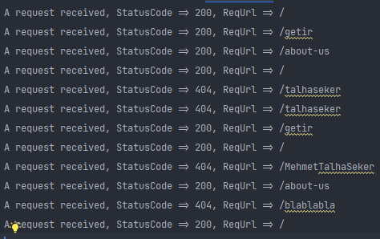
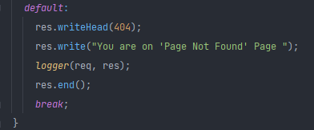
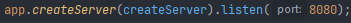
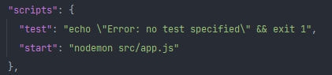

<h1>A simple App using HTTP module in NodeJS</h1>

## Author: MEHMET TALHA ŞEKER

<h2>What is http module?</h2>
It's default Nodejs module for creating basic http requests. To use this module, a import is required.  

***"const app = require("http");"***

After the import http module can be used.

  

Now we can use various functions with "req"(request) and "res"(response) keywords. These paramaters can be named at 
one's pleasure. With switch-case statement, routes can be specified. It's just a way to do it. It's not a rule, as you
can assume.

***"res.writehead(200)"*** indicates that the request is success and ***"res.write("blabla")"*** provides a body.

  

and ***"res.end"*** is for ending the response.
  
<h3>logger</h3>
"***logger***" is for logging requests to log.txt file.  

***fsLogger.js file***

***log.txt file***

***If the endpoint doesnt exists.***

  

Thanks to default keyword, http module can send ***"404(page not found)"*** as a response. And only the endpoints we
determined can be reached.

<h3>Creating and running the server</h3>

  

With the callback function, we've created the server. With ***"listen(8080)"*** the server started running on "8080" port.

Now we can start the server using "npm start" command. But first we need to configure it on package.json.

"node" command can be used instead of "nodemon". If you will, nodemon package makes things easier. It can be installed by
"npm install nodemon --save-dev". Nodemon provides a continuous experience running the server. With nodemon you dont have
to run the file everytime. It automatically restarts the server, everytime file changes.
